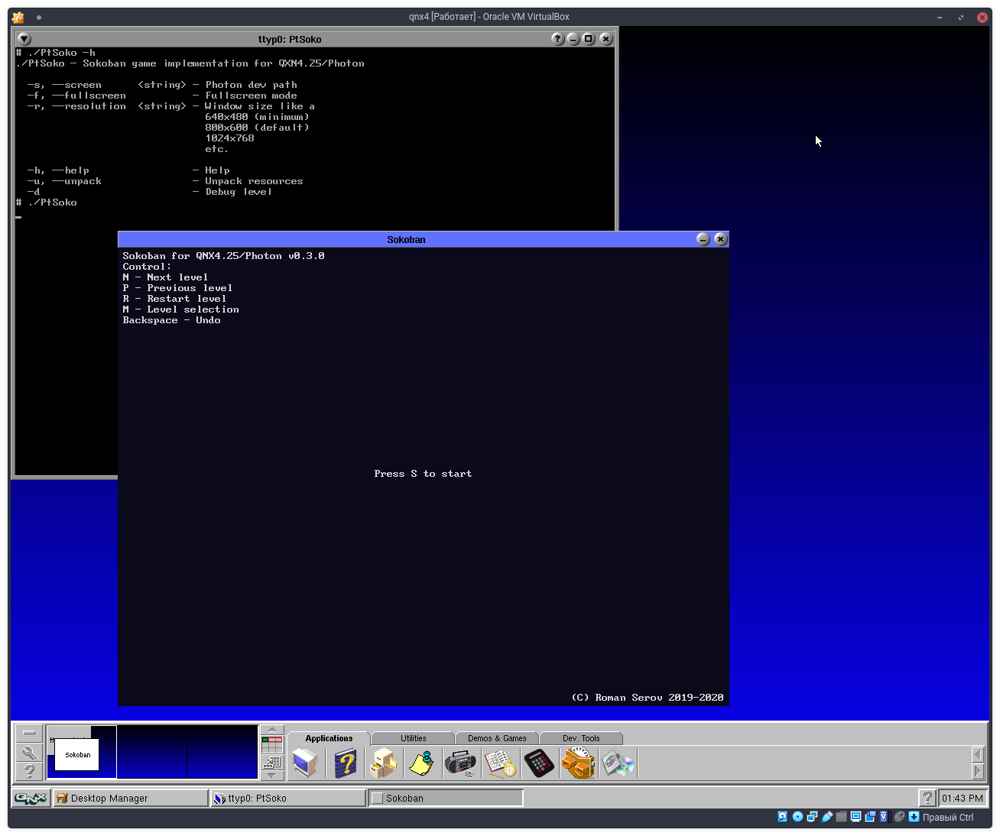

# Sokoban for QNX4.25/Photon

Захотелось мне как-то поиграть в сокобан под QNX'ом (что уже само по себе странно), и я с удвилением обнаружил, что его нет.

#### Инструкция по сборке

Соберём библиотеку разбора параметров командной строки
```
# ./buildq4o.sh
cc -5r -ms -Wc,-s -WC,-xss -Oentx -I./inc -c -o obj/re.o src/re.cpp
/usr/watcom/10.6/bin/wpp386 -zq -oentx -i=./inc -ms -fo=obj/re.o -xss -5r -i=/usr/watcom/10.6/usr/include -i=/usr/include -i=/usr/include/clk -i=/usr/include/clk/stl src/re.cpp 
cc -5r -ms -Wc,-s -WC,-xss -Oentx -I./inc -c -o obj/optparam.o src/optparam.cpp
/usr/watcom/10.6/bin/wpp386 -zq -oentx -i=./inc -ms -fo=obj/optparam.o -xss -5r -i=/usr/watcom/10.6/usr/include -i=/usr/include -i=/usr/include/clk -i=/usr/include/clk/stl src/optparam.cpp 
cc -5r -ms -Wc,-s -WC,-xss -Oentx -I./inc -c -o obj/optparser.o src/optparser.cpp
/usr/watcom/10.6/bin/wpp386 -zq -oentx -i=./inc -ms -fo=obj/optparser.o -xss -5r -i=/usr/watcom/10.6/usr/include -i=/usr/include -i=/usr/include/clk -i=/usr/include/clk/stl src/optparser.cpp 
wlib -b -c bin/qnx4opts.a obj/re.o obj/optparam.o obj/optparser.o
WATCOM Library Manager Version 10.6
Copyright by WATCOM International Corp. 1988, 1996. All rights reserved.
WATCOM is a trademark of WATCOM International Corp.
Warning! Could not open library 'bin/qnx4opts.a' : will be created.
```
Соберём саму игру
```
# make -f Makefile.game
cc -Oentx -ms -s -w1 -5r, -WC,-xss -I./inc -I./lib/qnx4opts/inc -c -o obj/debug.o src/debug.cpp
/usr/watcom/10.6/bin/wpp386 -zq -oentx -w1 -i=./inc -i=./lib/qnx4opts/inc -ms -fo=obj/debug.o -xss -5r -i=/usr/watcom/10.6/usr/include -i=/usr/include -i=/usr/include/clk -i=/usr/include/clk/stl src/debug.cpp 
cc -Oentx -ms -s -w1 -5r, -WC,-xss -I./inc -I./lib/qnx4opts/inc -c -o obj/palette.o src/palette.cpp
/usr/watcom/10.6/bin/wpp386 -zq -oentx -w1 -i=./inc -i=./lib/qnx4opts/inc -ms -fo=obj/palette.o -xss -5r -i=/usr/watcom/10.6/usr/include -i=/usr/include -i=/usr/include/clk -i=/usr/include/clk/stl src/palette.cpp 
cc -Oentx -ms -s -w1 -5r, -WC,-xss -I./inc -I./lib/qnx4opts/inc -c -o obj/level.o src/level.cpp
/usr/watcom/10.6/bin/wpp386 -zq -oentx -w1 -i=./inc -i=./lib/qnx4opts/inc -ms -fo=obj/level.o -xss -5r -i=/usr/watcom/10.6/usr/include -i=/usr/include -i=/usr/include/clk -i=/usr/include/clk/stl src/level.cpp 
cc -Oentx -ms -s -w1 -5r, -WC,-xss -I./inc -I./lib/qnx4opts/inc -c -o obj/help.o src/help.cpp
/usr/watcom/10.6/bin/wpp386 -zq -oentx -w1 -i=./inc -i=./lib/qnx4opts/inc -ms -fo=obj/help.o -xss -5r -i=/usr/watcom/10.6/usr/include -i=/usr/include -i=/usr/include/clk -i=/usr/include/clk/stl src/help.cpp 
cc -Oentx -ms -s -w1 -5r, -WC,-xss -I./inc -I./lib/qnx4opts/inc -c -o obj/level_preview.o src/level_preview.cpp
/usr/watcom/10.6/bin/wpp386 -zq -oentx -w1 -i=./inc -i=./lib/qnx4opts/inc -ms -fo=obj/level_preview.o -xss -5r -i=/usr/watcom/10.6/usr/include -i=/usr/include -i=/usr/include/clk -i=/usr/include/clk/stl src/level_preview.cpp 
cc -Oentx -ms -s -w1 -5r, -WC,-xss -I./inc -I./lib/qnx4opts/inc -c -o obj/level_background.o src/level_background.cpp
/usr/watcom/10.6/bin/wpp386 -zq -oentx -w1 -i=./inc -i=./lib/qnx4opts/inc -ms -fo=obj/level_background.o -xss -5r -i=/usr/watcom/10.6/usr/include -i=/usr/include -i=/usr/include/clk -i=/usr/include/clk/stl src/level_background.cpp 
cc -Oentx -ms -s -w1 -5r, -WC,-xss -I./inc -I./lib/qnx4opts/inc -c -o obj/box.o src/box.cpp
/usr/watcom/10.6/bin/wpp386 -zq -oentx -w1 -i=./inc -i=./lib/qnx4opts/inc -ms -fo=obj/box.o -xss -5r -i=/usr/watcom/10.6/usr/include -i=/usr/include -i=/usr/include/clk -i=/usr/include/clk/stl src/box.cpp 
cc -Oentx -ms -s -w1 -5r, -WC,-xss -I./inc -I./lib/qnx4opts/inc -c -o obj/box_place.o src/box_place.cpp
/usr/watcom/10.6/bin/wpp386 -zq -oentx -w1 -i=./inc -i=./lib/qnx4opts/inc -ms -fo=obj/box_place.o -xss -5r -i=/usr/watcom/10.6/usr/include -i=/usr/include -i=/usr/include/clk -i=/usr/include/clk/stl src/box_place.cpp 
cc -Oentx -ms -s -w1 -5r, -WC,-xss -I./inc -I./lib/qnx4opts/inc -c -o obj/object.o src/object.cpp
/usr/watcom/10.6/bin/wpp386 -zq -oentx -w1 -i=./inc -i=./lib/qnx4opts/inc -ms -fo=obj/object.o -xss -5r -i=/usr/watcom/10.6/usr/include -i=/usr/include -i=/usr/include/clk -i=/usr/include/clk/stl src/object.cpp 
cc -Oentx -ms -s -w1 -5r, -WC,-xss -I./inc -I./lib/qnx4opts/inc -c -o obj/brick.o src/brick.cpp
/usr/watcom/10.6/bin/wpp386 -zq -oentx -w1 -i=./inc -i=./lib/qnx4opts/inc -ms -fo=obj/brick.o -xss -5r -i=/usr/watcom/10.6/usr/include -i=/usr/include -i=/usr/include/clk -i=/usr/include/clk/stl src/brick.cpp 
cc -Oentx -ms -s -w1 -5r, -WC,-xss -I./inc -I./lib/qnx4opts/inc -c -o obj/player.o src/player.cpp
/usr/watcom/10.6/bin/wpp386 -zq -oentx -w1 -i=./inc -i=./lib/qnx4opts/inc -ms -fo=obj/player.o -xss -5r -i=/usr/watcom/10.6/usr/include -i=/usr/include -i=/usr/include/clk -i=/usr/include/clk/stl src/player.cpp 
cc -Oentx -ms -s -w1 -5r, -WC,-xss -I./inc -I./lib/qnx4opts/inc -c -o obj/game.o src/game.cpp
/usr/watcom/10.6/bin/wpp386 -zq -oentx -w1 -i=./inc -i=./lib/qnx4opts/inc -ms -fo=obj/game.o -xss -5r -i=/usr/watcom/10.6/usr/include -i=/usr/include -i=/usr/include/clk -i=/usr/include/clk/stl src/game.cpp 
cc -Oentx -ms -s -w1 -5r, -WC,-xss -I./inc -I./lib/qnx4opts/inc -c -o obj/timer.o src/timer.cpp
/usr/watcom/10.6/bin/wpp386 -zq -oentx -w1 -i=./inc -i=./lib/qnx4opts/inc -ms -fo=obj/timer.o -xss -5r -i=/usr/watcom/10.6/usr/include -i=/usr/include -i=/usr/include/clk -i=/usr/include/clk/stl src/timer.cpp 
cc -Oentx -ms -s -w1 -5r, -WC,-xss -I./inc -I./lib/qnx4opts/inc -c -o obj/menu.o src/menu.cpp
/usr/watcom/10.6/bin/wpp386 -zq -oentx -w1 -i=./inc -i=./lib/qnx4opts/inc -ms -fo=obj/menu.o -xss -5r -i=/usr/watcom/10.6/usr/include -i=/usr/include -i=/usr/include/clk -i=/usr/include/clk/stl src/menu.cpp 
cc -Oentx -ms -s -w1 -5r, -WC,-xss -I./inc -I./lib/qnx4opts/inc -c -o obj/resources.o src/resources.cpp
/usr/watcom/10.6/bin/wpp386 -zq -oentx -w1 -i=./inc -i=./lib/qnx4opts/inc -ms -fo=obj/resources.o -xss -5r -i=/usr/watcom/10.6/usr/include -i=/usr/include -i=/usr/include/clk -i=/usr/include/clk/stl src/resources.cpp 
cc -Oentx -ms -s -w1 -5r, -WC,-xss -I./inc -I./lib/qnx4opts/inc -c -o obj/respack.o src/respack.cpp
/usr/watcom/10.6/bin/wpp386 -zq -oentx -w1 -i=./inc -i=./lib/qnx4opts/inc -ms -fo=obj/respack.o -xss -5r -i=/usr/watcom/10.6/usr/include -i=/usr/include -i=/usr/include/clk -i=/usr/include/clk/stl src/respack.cpp 
cc -Oentx -ms -s -w1 -5r, -WC,-xss -I./inc -I./lib/qnx4opts/inc -c -o obj/main_game.o src/main_game.cpp
/usr/watcom/10.6/bin/wpp386 -zq -oentx -w1 -i=./inc -i=./lib/qnx4opts/inc -ms -fo=obj/main_game.o -xss -5r -i=/usr/watcom/10.6/usr/include -i=/usr/include -i=/usr/include/clk -i=/usr/include/clk/stl src/main_game.cpp 
cc -M -N 64k -lphoton -l/qnx4/phtk/lib/phrender_s.lib -l/qnx4/phtk/lib/phexlib3r.lib -llib/qnx4opts/bin/qnx4opts.a -o bin/PtSoko obj/debug.o obj/palette.o obj/level.o obj/help.o obj/level_preview.o obj/level_background.o obj/box.o obj/box_place.o obj/object.o obj/brick.o obj/player.o obj/game.o obj/timer.o obj/menu.o obj/resources.o obj/respack.o obj/main_game.o
/usr/watcom/10.6/bin/wlink op quiet form qnx flat na bin/PtSoko op static op map=bin/PtSoko.map op priv=3 op c libp /usr/watcom/10.6/usr/lib:/usr/lib:. l /usr/lib/photon3r.lib l /qnx4/phtk/lib/phrender_s.lib l /qnx4/phtk/lib/phexlib3r.lib l lib/qnx4opts/bin/qnx4opts.a f obj/debug.o f obj/palette.o f obj/level.o f obj/help.o f obj/level_preview.o f obj/level_background.o f obj/box.o f obj/box_place.o f obj/object.o f obj/brick.o f obj/player.o f obj/game.o f obj/timer.o f obj/menu.o f obj/resources.o f obj/respack.o f obj/main_game.o op offset=388k op st=64k  
Warning(1027): file obj/level_background.o(/root/projects/PtSoko/src/level_background.cpp): redefinition of _PxImageFunc ignored
Warning(1027): file obj/box.o(/root/projects/PtSoko/src/box.cpp): redefinition of _PxImageFunc ignored
Warning(1027): file obj/box_place.o(/root/projects/PtSoko/src/box_place.cpp): redefinition of _PxImageFunc ignored
Warning(1027): file obj/object.o(/root/projects/PtSoko/src/object.cpp): redefinition of _PxImageFunc ignored
Warning(1027): file obj/brick.o(/root/projects/PtSoko/src/brick.cpp): redefinition of _PxImageFunc ignored
Warning(1027): file obj/player.o(/root/projects/PtSoko/src/player.cpp): redefinition of _PxImageFunc ignored
Warning(1027): file obj/game.o(/root/projects/PtSoko/src/game.cpp): redefinition of _PxImageFunc ignored
Warning(1027): file obj/resources.o(/root/projects/PtSoko/src/resources.cpp): redefinition of _PxImageFunc ignored
Warning(1027): file obj/main_game.o(/root/projects/PtSoko/src/main_game.cpp): redefinition of _PxImageFunc ignored
```
Соберём упаковщик/распаковщик ресурсов
```
# make -f Makefile.packer
cc -Oentx -ms -s -w1 -5r, -WC,-xss -I./inc -I./lib/qnx4opts/inc -c -o obj/main_packer.o src/main_packer.cpp
/usr/watcom/10.6/bin/wpp386 -zq -oentx -w1 -i=./inc -i=./lib/qnx4opts/inc -ms -fo=obj/main_packer.o -xss -5r -i=/usr/watcom/10.6/usr/include -i=/usr/include -i=/usr/include/clk -i=/usr/include/clk/stl src/main_packer.cpp 
cc -M -N 64k -lphoton -llib/qnx4opts/bin/qnx4opts.a -o bin/PtSokoPacker obj/debug.o obj/help.o obj/respack.o obj/main_packer.o
/usr/watcom/10.6/bin/wlink op quiet form qnx flat na bin/PtSokoPacker op static op map=bin/PtSokoPacker.map op priv=3 op c libp /usr/watcom/10.6/usr/lib:/usr/lib:. l /usr/lib/photon3r.lib l lib/qnx4opts/bin/qnx4opts.a f obj/debug.o f obj/help.o f obj/respack.o f obj/main_packer.o op offset=72k op st=64k
```
Упакуем ресурсы
```
# bin/PtSokoPacker -p res/.ptsoko res/res.pack
Packing...
Scanning 'res/.ptsoko'
Dir:     levels
File:      levels/.placeholder
File:      levels/level01.lvl
File:      levels/level02.lvl
File:      levels/level03.lvl
File:      levels/level04.lvl
File:      levels/level05.lvl
File:      levels/level06.lvl
File:      levels/level07.lvl
File:      levels/level08.lvl
File:      levels/level09.lvl
File:      levels/level10.lvl
File:      levels/level11.lvl
File:      levels/level12.lvl
File:      levels/level13.lvl
File:      levels/level14.lvl
File:      levels/level15.lvl
File:      levels/level16.lvl
File:      levels/level17.lvl
File:      levels/level18.lvl
File:      levels/level19.lvl
File:      levels/level20.lvl
File:      levels/level21.lvl
File:      levels/level22.lvl
File:      levels/level23.lvl
File:      levels/level24.lvl
File:      levels/level25.lvl
File:      levels/level26.lvl
File:      levels/level27.lvl
File:      levels/level28.lvl
File:      levels/level29.lvl
File:      levels/level30.lvl
File:      levels/level31.lvl
File:      levels/level32.lvl
File:      levels/level33.lvl
File:      levels/level34.lvl
File:      levels/level35.lvl
File:      levels/level36.lvl
File:      levels/level37.lvl
File:      levels/level38.lvl
File:      levels/level39.lvl
File:      levels/level40.lvl
File:      levels/level41.lvl
File:      levels/level42.lvl
File:      levels/level43.lvl
File:      levels/level44.lvl
File:      levels/level45.lvl
File:      levels/level46.lvl
File:      levels/level47.lvl
File:      levels/level48.lvl
File:      levels/level49.lvl
File:      levels/level50.lvl
File:      levels/level51.lvl
File:      levels/level52.lvl
File:      levels/level53.lvl
File:      levels/level54.lvl
File:      levels/level55.lvl
File:      levels/level56.lvl
File:      levels/level57.lvl
File:      levels/level58.lvl
File:      levels/level59.lvl
File:      levels/level60.lvl
File:      levels/level61.lvl
File:      levels/level62.lvl
File:      levels/level63.lvl
File:      levels/level64.lvl
File:      levels/level65.lvl
File:      levels/level66.lvl
File:      levels/level67.lvl
File:      levels/level68.lvl
File:      levels/level69.lvl
File:      levels/level70.lvl
File:      levels/level71.lvl
File:      levels/level72.lvl
File:      levels/level73.lvl
File:      levels/level74.lvl
File:      levels/level75.lvl
File:      levels/level76.lvl
File:      levels/level77.lvl
File:      levels/level78.lvl
File:      levels/level79.lvl
File:      levels/level80.lvl
File:      levels/level81.lvl
File:      levels/level82.lvl
File:      levels/level83.lvl
File:      levels/level84.lvl
File:      levels/level85.lvl
File:      levels/level86.lvl
File:      levels/level87.lvl
File:      levels/level88.lvl
File:      levels/level89.lvl
File:      levels/level90.lvl
Dir:     stat
File:      stat/.placeholder
Dir:     textures
File:      textures/.placeholder
File:      textures/box_18.bmp
File:      textures/box_24.bmp
File:      textures/box_30.bmp
File:      textures/box_36.bmp
File:      textures/box_42.bmp
File:      textures/box_place_18.bmp
File:      textures/box_place_24.bmp
File:      textures/box_place_30.bmp
File:      textures/box_place_36.bmp
File:      textures/box_place_42.bmp
File:      textures/brick_18.bmp
File:      textures/brick_24.bmp
File:      textures/brick_30.bmp
File:      textures/brick_36.bmp
File:      textures/brick_42.bmp
File:      palette.dat
Records: 112
Writing MAGICK_CONST...OK
Writing DATA_BEGIN_SIGNATURE...OK
Writing records count...OK
Writing file 'levels/level01.lvl'...OK
Writing file 'levels/level02.lvl'...OK
Writing file 'levels/level03.lvl'...OK
Writing file 'levels/level04.lvl'...OK
Writing file 'levels/level05.lvl'...OK
Writing file 'levels/level06.lvl'...OK
Writing file 'levels/level07.lvl'...OK
Writing file 'levels/level08.lvl'...OK
Writing file 'levels/level09.lvl'...OK
Writing file 'levels/level10.lvl'...OK
Writing file 'levels/level11.lvl'...OK
Writing file 'levels/level12.lvl'...OK
Writing file 'levels/level13.lvl'...OK
Writing file 'levels/level14.lvl'...OK
Writing file 'levels/level15.lvl'...OK
Writing file 'levels/level16.lvl'...OK
Writing file 'levels/level17.lvl'...OK
Writing file 'levels/level18.lvl'...OK
Writing file 'levels/level19.lvl'...OK
Writing file 'levels/level20.lvl'...OK
Writing file 'levels/level21.lvl'...OK
Writing file 'levels/level22.lvl'...OK
Writing file 'levels/level23.lvl'...OK
Writing file 'levels/level24.lvl'...OK
Writing file 'levels/level25.lvl'...OK
Writing file 'levels/level26.lvl'...OK
Writing file 'levels/level27.lvl'...OK
Writing file 'levels/level28.lvl'...OK
Writing file 'levels/level29.lvl'...OK
Writing file 'levels/level30.lvl'...OK
Writing file 'levels/level31.lvl'...OK
Writing file 'levels/level32.lvl'...OK
Writing file 'levels/level33.lvl'...OK
Writing file 'levels/level34.lvl'...OK
Writing file 'levels/level35.lvl'...OK
Writing file 'levels/level36.lvl'...OK
Writing file 'levels/level37.lvl'...OK
Writing file 'levels/level38.lvl'...OK
Writing file 'levels/level39.lvl'...OK
Writing file 'levels/level40.lvl'...OK
Writing file 'levels/level41.lvl'...OK
Writing file 'levels/level42.lvl'...OK
Writing file 'levels/level43.lvl'...OK
Writing file 'levels/level44.lvl'...OK
Writing file 'levels/level45.lvl'...OK
Writing file 'levels/level46.lvl'...OK
Writing file 'levels/level47.lvl'...OK
Writing file 'levels/level48.lvl'...OK
Writing file 'levels/level49.lvl'...OK
Writing file 'levels/level50.lvl'...OK
Writing file 'levels/level51.lvl'...OK
Writing file 'levels/level52.lvl'...OK
Writing file 'levels/level53.lvl'...OK
Writing file 'levels/level54.lvl'...OK
Writing file 'levels/level55.lvl'...OK
Writing file 'levels/level56.lvl'...OK
Writing file 'levels/level57.lvl'...OK
Writing file 'levels/level58.lvl'...OK
Writing file 'levels/level59.lvl'...OK
Writing file 'levels/level60.lvl'...OK
Writing file 'levels/level61.lvl'...OK
Writing file 'levels/level62.lvl'...OK
Writing file 'levels/level63.lvl'...OK
Writing file 'levels/level64.lvl'...OK
Writing file 'levels/level65.lvl'...OK
Writing file 'levels/level66.lvl'...OK
Writing file 'levels/level67.lvl'...OK
Writing file 'levels/level68.lvl'...OK
Writing file 'levels/level69.lvl'...OK
Writing file 'levels/level70.lvl'...OK
Writing file 'levels/level71.lvl'...OK
Writing file 'levels/level72.lvl'...OK
Writing file 'levels/level73.lvl'...OK
Writing file 'levels/level74.lvl'...OK
Writing file 'levels/level75.lvl'...OK
Writing file 'levels/level76.lvl'...OK
Writing file 'levels/level77.lvl'...OK
Writing file 'levels/level78.lvl'...OK
Writing file 'levels/level79.lvl'...OK
Writing file 'levels/level80.lvl'...OK
Writing file 'levels/level81.lvl'...OK
Writing file 'levels/level82.lvl'...OK
Writing file 'levels/level83.lvl'...OK
Writing file 'levels/level84.lvl'...OK
Writing file 'levels/level85.lvl'...OK
Writing file 'levels/level86.lvl'...OK
Writing file 'levels/level87.lvl'...OK
Writing file 'levels/level88.lvl'...OK
Writing file 'levels/level89.lvl'...OK
Writing file 'levels/level90.lvl'...OK
Writing file 'textures/box_18.bmp'...OK
Writing file 'textures/box_24.bmp'...OK
Writing file 'textures/box_30.bmp'...OK
Writing file 'textures/box_36.bmp'...OK
Writing file 'textures/box_42.bmp'...OK
Writing file 'textures/box_place_18.bmp'...OK
Writing file 'textures/box_place_24.bmp'...OK
Writing file 'textures/box_place_30.bmp'...OK
Writing file 'textures/box_place_36.bmp'...OK
Writing file 'textures/box_place_42.bmp'...OK
Writing file 'textures/brick_18.bmp'...OK
Writing file 'textures/brick_24.bmp'...OK
Writing file 'textures/brick_30.bmp'...OK
Writing file 'textures/brick_36.bmp'...OK
Writing file 'textures/brick_42.bmp'...OK
Writing file 'palette.dat'...OK
Writing records structure...OK
Writing DATA_END_SIGNATURE...OK
```
Встроим ресурсы в исполняемый файл игры. При первом запуске игры, если ресурсы будут не найдены, они автоматически распакуются в каталог ~/.ptsoko
```
# bin/PtSokoPacker -b res/res.pack bin/PtSoko
#
```

#### Описание параметров PtSoko

```
# ./PtSoko -h
./PtSoko - Sokoban game implementation for QXN4.25/Photon

  -s, --screen      <string> - Photon dev path
  -f, --fullscreen           - Fullscreen mode
  -r, --resolution  <string> - Window size like a
                               640x480 (minimum)
                               800x600 (default)
                               1024x768
                               etc.

  -h, --help                 - Help
  -u, --unpack               - Unpack resources
  -d                         - Debug level
  ```
- -s Путь к устройству Photon
- -f Полноэкранный режим
- -r Разрешение окна, при работе в оконном режиме
- -h Вывод справки
- -u Принудительно распаковать ресурсы, при условии что они были встроены в исполняемый файл
-  -d Уровень отладочных сообщений
#### Описание параметров PtSokoPacker
```
# ./PtSokoPacker -h
./PtSokoPacker - Sokoban game resource packer for QXN4.25/Photon

  -p, --pack                    - <dir> <res> Pack files from directory to resource file
  -u, --unpack                  - <res> <dir> Unpack resource file
  -b, --binary-pack             - <res> <bin> Add resource pack to binary file
  -c, --binary-unpack           - <bin> <dir> Unpack binary
  ```

- -p Упаковать ресурсы из указанного каталога в файл
- -u Распаковать ресурсы из файла в указанный каталог
- -b Встроить файл ресурсов в исполняемый файл
- -c Распаковать ресурсы из исполняемого файла

#### А теперь, слайды:




